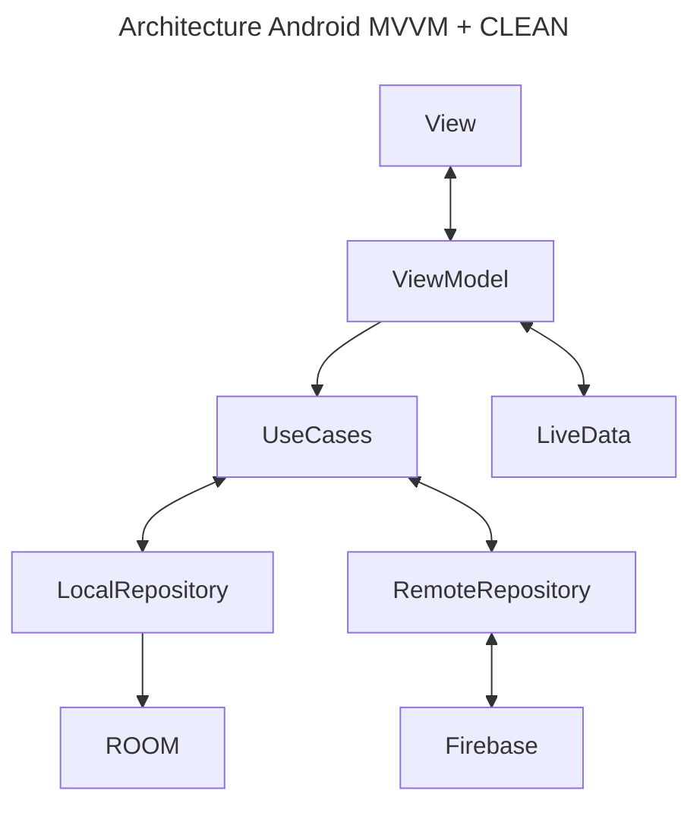

# Android Stori Technical Test

## Overview
This repository contains the solution for the Android Stori Technical Test. The challenge was to create a banking application that allows user registration, login, and provides bank information such as balance and transaction history.

## Challenge Details
The application is expected to fulfill the following requirements:

- **Registration**: Implement an onboarding process including user personal data collection and taking an identification photo.
- **User Login**: Create a login screen with options for email, password, and registration.
- **Home Screen**: Display user's bank details including balance and list of transactions. Clicking on a transaction should navigate to its details.
- **Problem to Solve**: Implement validation for user data and password. Upon successful login, display the home screen. Provide navigation to the registration screen.

## Problems to Solve
The following issues needed to be addressed:
- Validate user data and password during login.
- Display home screen upon successful login.
- Implement registration process including user data collection, ID photo capture, and display success message.
- Store collected data in Firebase database.
- Create test data in Firebase for testing user login without account creation.

### Technologies Used
- Android SDK
- Navigation
- Room
- Lottie
- Hilt
- Firebase for database management and authentication.

## How to Run
- Clone repo
- Add project into Android Studio
- Run project

### Credentials
- user: nsanchez@stori.mx
- password: SimplePlan$04

## Future Improvements
- Add a loader to the entire project
- Unit test

## Architecture

## Video

## Authors
- [@NormanSN](https://www.linkedin.com/in/norman-sanchez-nolasco/) - Android Developer

